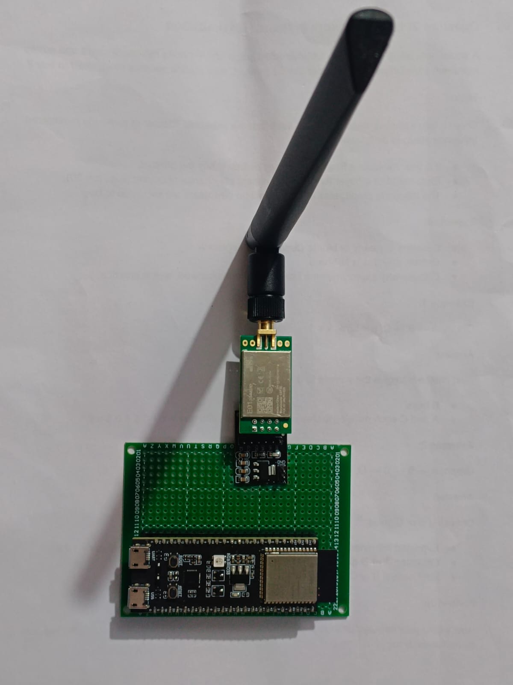

# Decentralized Network (ESP32 + NRF24L01)

Lightweight, crypto-enabled, delay-/disruption-tolerant mesh networking stack for ESP32 nodes using NRF24L01 radios. Provides dynamic neighbor discovery, multi-hop routing (onion-style relaying), and an optional Wi‑Fi DTN server bridge for ingress/egress.

---

## Demo Media

<video src="Fusion%20Node%20Internal%20Arch.mp4" controls width="720">
  Your browser does not support the video tag. Watch the video here:
  <a href="Fusion%20Node%20Internal%20Arch.mp4">Fusion Node Internal Arch.mp4</a>
</video>

---

## Current Status

- **DTN server**: working
- **NRF24 transmission module**: working
- **Dynamic mesh discovery**: working

---

## Features

- **Delay-/Disruption-Tolerant Networking (DTN)**: Store-and-forward messaging for intermittent links.
- **NRF24L01 transport**: Low-power 2.4 GHz radio link with configurable data rate/channel.
- **Dynamic mesh discovery**: Automatic neighbor detection and path building.
- **Onion-style relaying**: Layered multi-hop forwarding to enhance privacy.
- **Cryptography**: Built on [Monocypher](https://monocypher.org/) for modern, small-footprint primitives.
- **Wi‑Fi DTN bridge/server**: Optional Wi‑Fi interface for gateway/monitoring.

---

## Repository Layout

- `esp32_fusion_node.ino.ino` — Main ESP32 sketch entry point
- `node_config.h` — Node- and build-time configuration (IDs, pins, RF params, Wi‑Fi)
- Radio
  - `radio.h`, `radio_nrf24.cpp` — NRF24L01 driver/abstraction
- Mesh & Routing
  - `mesh.h`, `mesh.cpp` — Mesh logic and dynamic discovery
  - `dtn.h`, `dtn.cpp` — DTN core (queues, store-and-forward)
  - `onion.h`, `onion.cpp` — Onion-style multi-hop encapsulation
- Crypto
  - `crypto_abstraction.h`, `crypto_abstraction.cpp` — Crypto utilities
  - `src/monocypher/monocypher.c`, `src/monocypher/monocypher.h` — Monocypher library
- Storage & Utilities
  - `storage.h`, `storage.cpp` — Persistent/local storage helpers
  - `wifi_setup.h`, `wifi_setup.cpp` — Wi‑Fi setup and DTN bridge

---

## Hardware Requirements

- **ESP32** development board (e.g., DevKitC)
- **NRF24L01(+)** radio module (PA/LNA version optional)
- Antenna (if using PA/LNA variant)
- Jumper wires, 3.3V power (stable supply recommended for PA/LNA)

> Pin mapping for CE/CSN and SPI should be set in `node_config.h`. Ensure 3.3V logic; do not power NRF24L01 from 5V.

---

## Build & Flash (Arduino IDE)

1. Install Arduino IDE (2.x recommended) and the **ESP32 Board Support** via Boards Manager.
2. Open `esp32_fusion_node.ino.ino`.
3. Configure your node in `node_config.h`:
   - **Node ID**, **RF channel/bitrate**, **CE/CSN pins**
   - Wi‑Fi credentials (if using DTN Wi‑Fi bridge)
4. Verify sources are included:
   - Arduino compiles `.c/.cpp` within the sketch project. If you see link errors for Monocypher, place `src/monocypher/monocypher.c` and `monocypher.h` in your sketch folder or add them via a local library.
5. Select the correct ESP32 board and COM port, then click **Upload**.

---

## Run & Observe

1. Power the ESP32 + NRF24L01 node(s).
2. On boot, nodes initialize the radio, perform dynamic neighbor discovery, and join the mesh.
3. If Wi‑Fi is enabled/configured, the DTN server/bridge starts and exposes an interface for message ingress/egress.
4. Open Serial Monitor for logs (baud as configured in the sketch) to observe mesh discovery and DTN events.

---

## Configuration Notes

- `node_config.h` is the single source of truth for:
  - **Node identity** and addressing
  - **RF parameters** (channel, data rate, power)
  - **GPIO pins** for CE/CSN (NRF24)
  - **Wi‑Fi SSID/password** and DTN server options

---

## Roadmap (Ideas)

- Message reliability (ACK/retry at DTN layer)
- Persistent DTN queue across reboots
- Gateway tools and desktop visualizer
- Optional Bluetooth LE bridge

---

## Troubleshooting

- **Radio not responding**: Check 3.3V power quality, CE/CSN pin mapping, and SPI wiring.
- **No mesh neighbors**: Ensure nodes share RF channel/bitrate and are within range; verify antennas.
- **DTN server not reachable**: Confirm Wi‑Fi credentials and that the feature is enabled in `node_config.h`.
- **Crypto build errors**: Ensure Monocypher sources are compiled into the project.

---

## License

No license file found. Consider adding a license (e.g., MIT/Apache-2.0) to clarify usage.

## Acknowledgements

- [Monocypher](https://monocypher.org/) — small, easy-to-use crypto library.